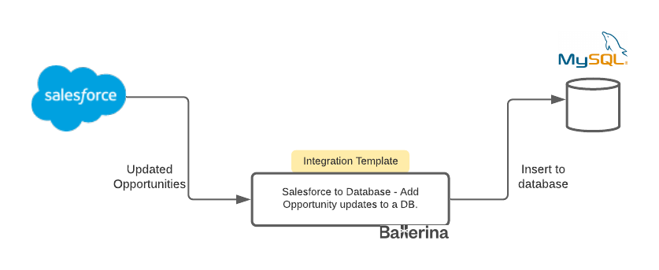

# Salesforce to Database - Add Opportunity updates to a DB.


## Integration Use Case 

This integration template listens to the updated on Salesforce Opportunities and publishes the updated opportunities to a database.     




## Prerequisites

- [Ballerina Distribution](https://ballerina.io/learn/getting-started/)
- A Text Editor or an IDE ([VSCode](https://marketplace.visualstudio.com/items?itemName=ballerina.ballerina), 
[IntelliJ IDEA](https://plugins.jetbrains.com/plugin/9520-ballerina)).  
- [Salesforce Connector](https://github.com/ballerina-platform/module-ballerinax-sfdc) will be downloaded from 
[Ballerina Central](https://central.ballerina.io/) when running the Ballerina file.

## Confuguring source and target APIs/systems

Let's first see how to add the Salesforce configurations for the application.

#### Setup Salesforce configurations
Create a Salesforce account and create a connected app by visiting [Salesforce](https://www.salesforce.com). 
Obtain the following parameters:

* Base URL (Endpoint)
* Client Id
* Client Secret
* Access Token
* Refresh Token
* Refresh URL

For more information on obtaining OAuth2 credentials, visit 
[Salesforce help documentation](https://help.salesforce.com/articleView?id=remoteaccess_authenticate_overview.htm) 
or follow the 
[Setup tutorial](https://medium.com/@bpmmendis94/obtain-access-refresh-tokens-from-salesforce-rest-api-a324fe4ccd9b).

Also, keep a note of your Salesforce username, password and the security token that will be needed for initializing the listener. 

For more information on the secret token, please visit [Reset Your Security Token](https://help.salesforce.com/articleView?id=user_security_token.htm&type=5).

#### Create push topic in Salesforce developer console

The Salesforce trigger requires topics to be created for each event. We need to configure two topics as we listen on 
both Opportunity and Quote entities.

1. From the Salesforce UI, select developer console. Go to debug > Open Execute Anonymous Window. 
2. Paste following apex code to create 'OpportunityUpdate' topic
```apex
PushTopic pushTopic = new PushTopic();
pushTopic.Name = 'OpportunityUpdate';
pushTopic.Query = 'SELECT Id, Name, AccountId, StageName, Amount FROM Opportunity';
pushTopic.ApiVersion = 48.0;
pushTopic.NotifyForOperationUpdate = true;
pushTopic.NotifyForFields = 'Referenced';
insert pushTopic;
```
3. Execute another window and paste following to create 'QuoteUpdate' topic
```apex
PushTopic pushTopic = new PushTopic();
pushTopic.Name = 'QuoteUpdate';
pushTopic.Query = 'SELECT Id, Name, AccountId, OpportunityId, Status,GrandTotal  FROM Quote';
pushTopic.ApiVersion = 48.0;
pushTopic.NotifyForOperationUpdate = true;
pushTopic.NotifyForFields = 'Referenced';
insert pushTopic;
```
4. Once the creation is done, specify the topic name in each event listener service config.

## Confuring the Integration Template

Once you obtained all configurations, Replace "" in the `ballerina.conf` file with your data.

##### ballerina.conf
```
SF_EP_URL=""
SF_ACCESS_TOKEN=""
SF_CLIENT_ID="" 
SF_CLIENT_SECRET=""
SF_REFRESH_TOKEN=""
SF_REFRESH_URL=""

SF_USERNAME=""
SF_PASSWORD=""
SF_OPPORTUNITY_TOPIC=""

DB_USER=""
DB_PWD=""

```

#### Setup Database
1. The opportunity updates are added to a database and this template uses MySQL as the RDBMS. 
2. You can create the required database and the tables using [opportunities.sql](./opportunities.sql) script. 
3. Based on the use case that you implement, you can change the database schema and the content that you wish to add to the database. 


## Running the Template

1. First you need to build the integration template and create the executable binary. Run the following command from the root directory of the integration template. 
`$ ballerina build -a`. 

2. Then you can run the integration binary with the following command. 
`$ java -jar target/bin/sfdcoppupdates.jar`. 

Successful listener startup will print following in the console.
```
>>>>
[2020-09-25 11:10:55.552] Success:[/meta/handshake]
{ext={replay=true, payload.format=true}, minimumVersion=1.0, clientId=1mc1owacqlmod21gwe8arhpxaxxm, supportedConnectionTypes=[Ljava.lang.Object;@21a089fc, channel=/meta/handshake, id=1, version=1.0, successful=true}
<<<<
>>>>
[2020-09-25 11:10:55.629] Success:[/meta/connect]
{clientId=1mc1owacqlmod21gwe8arhpxaxxm, advice={reconnect=retry, interval=0, timeout=110000}, channel=/meta/connect, id=2, successful=true}
<<<<
```

3. Now you can update an existing Salesforce Opportunity and observe that integration template runtime has received the event notification for the updated Salesforce Opportunity.

4. Also you can check the Opportunity table of the database to verify that the updated Opportunity is added to the table. 


